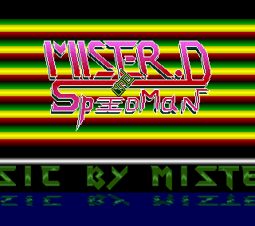
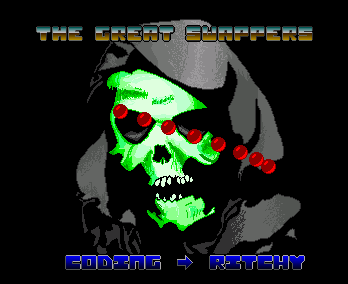
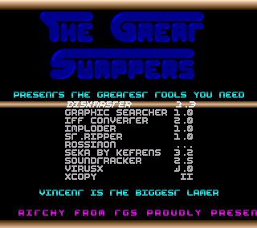
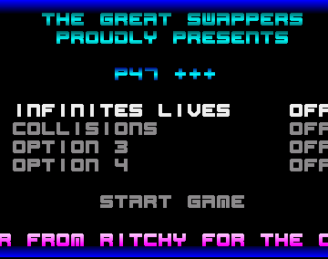
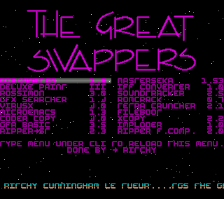

# Amiga
Amiga Demos in 68000 ASM

## First Intro

### Description

My very first Amiga 500 intro made in 1989. Some basic coppers, waving logo and scrolltext. If you are running an emulator, disable all cache and acceleration or the intro will run too fast (lamer vertical sync).

### Launch

- In folder "Mrd1" launch SEKA.
- Choose memory allocation (for example Chip 100K)
- Load the code: "r", then "intro1.s"
- Assemble the code: "a" (no option)
- Load the data binaries (logo, music, font): "y"
- Run the demo: "jr"

## TGS Crack Intro

### Description

Crack intro that has been used several times. I remember it was before Sherman M4 game. It has been released at Lucyfer's home during an afternoon.
The intro has 8 sprites and a very quick scroller.

### Launch

- In folder "TgsCrackIntro" launch SEKA.
- Choose memory allocation (for example Chip 100K)
- Load the code: "r", then "intro.s"
- Assemble the code: "a" (no option)
- Load the data binaries (logo, music, font, precalc sprite positions): "y"
- Run the demo: "jr"

## TGS Menu 1

### Description

TGS released several compilations. This menu was done to select the programs to start. There are some short explanations in the source to tell the mates how to use / configure the menu.

### Launch

- In folder "TgsMenu1" launch MasterSEKA.
- Choose memory allocation (for example Chip 100K)
- Load the code: "r", then "menu.s"
- Assemble the code: "a" (no option)
- Load the data binaries: "y"
- Run the demo: "jr"

## TGS Trainer

### Description

TGS Trainer. This menu has been done to activate cheat codes in games. It is controllable with the Joystick. Instructions for the cracker are in the source.

### Launch

- In folder "TgsTrainer" launch MasterSEKA.
- Choose memory allocation (for example Chip 100K)
- Load the code: "r", then "trainer1.s"
- Assemble the code: "a" (no option)
- Load the data binaries: "y"
- Run the demo: "jr"

## TGS Menu 3

### Description

Control is done with the Keyboard. The music is done with Future Composer 1.3 so there is the replay routine here.

### Launch

- In folder "TgsMenu3" launch MasterSEKA.
- Choose memory allocation (for example Chip 100K)
- Load the code: "r", then "menu3.s"
- Assemble the code: "a" (no option)
- Load the data binaries: "y"
- Run the demo: "jr"

